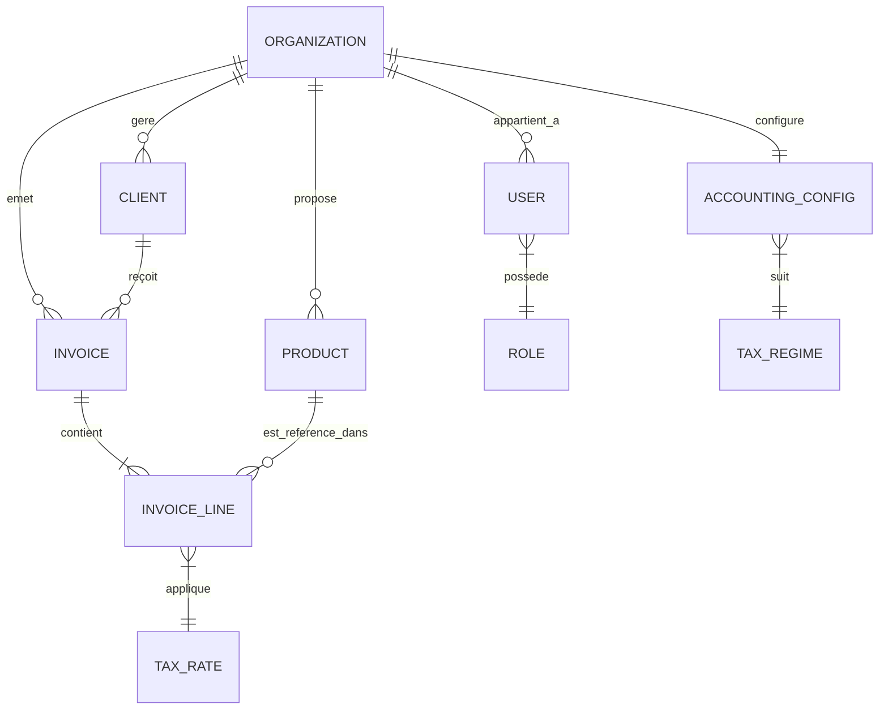

# Modèle de Données - GEKKO-Entreprise (Micro-ERP SaaS)

Ce document détaille la structure de la base de données nécessaire pour supporter les fonctionnalités de gestion, de facturation et de conformité comptable au Maroc.

## Schéma Conceptuel (ERD)

## Description des Entités

### 1. Organisation (Entrepreneur / TPE)
C'est le "Tenant" principal. Chaque entrepreneur a sa propre organisation.
- **id** (UUID): Clé primaire.
- **nom_social**: Nom de l'entreprise.
- **forme_juridique**: (SARL, Auto-entrepreneur, etc.).
- **adresse**: Siège social.
- **ICE**: Identifiant Commun de l'Entreprise (15 chiffres). [OBLIGATOIRE]
- **IF**: Identifiant Fiscal.
- **RC**: Numéro de Registre du Commerce.
- **TP_Patente**: Taxe Professionnelle.
- **CNSS**: Numéro d'affiliation.
- **capital_social**: (Optionnel).

### 2. Utilisateurs & Rôles
- **User**:
    - **id**, **email**, **password_hash**.
    - **role_id**: Lien vers le rôle.
    - **organization_id**: Lien vers l'organisation.
- **Role**:
    - **name**: (Admin, Comptable, Commercial).
    - **permissions**: JSON ou drapeaux (read_invoice, create_invoice, edit_settings, etc.).

### 3. Clients
- **id**, **organization_id**.
- **nom_complet / Raison sociale**.
- **ICE**: (Obligatoire pour les clients B2B au Maroc).
- **IF**, **Adresse**.
- **contact_nom**, **email**, **telephone**.

### 4. Produits & Services
- **id**, **organization_id**.
- **reference**: (Sku).
- **designation**: Nom du produit/service.
- **prix_unitaire_ht**: Prix de base.
- **unite**: (Heure, Jour, Unité, Kg, etc.).
- **default_tax_rate_id**: Taux de TVA par défaut associé.

### 5. Factures (Invoices)
- **id**, **organization_id**, **client_id**.
- **numero**: (Ex: FA-2024-001). Chronologie stricte à respecter.
- **date_emission**: Date de la facture.
- **date_echeance**: Date limite de paiement.
- **statut**: (Brouillon, Editée, Payée, Annulée).
- **mode_paiement**: (Virement, Chèque, Espèces, etc.).
- **total_ht**, **total_tva**, **total_ttc**.

### 6. Lignes de Facture (Invoice Lines)
- **id**, **invoice_id**, **product_id**.
- **description**: Pour personnalisation sur la facture.
- **quantite**, **prix_unitaire_ht**.
- **taux_tva_id**: Appliqué spécifiquement à cette ligne.
- **montant_tva**, **montant_ttc**.

### 7. Configuration Comptable & Taxes
- **TaxRate**:
    - **valeur**: (20, 14, 10, 7, 0).
    - **label**: (Standard, Intermédiaire, Réduit, Super-réduit, Exonéré).
- **AccountingConfig**:
    - **regime_tva**: (Débits ou Encaissements).
    - **secteur_activite**: Détermine le taux par défaut.
    - **cloture_exercice**: Date de fin de l'exercice (généralement 31/12).

---

## Intégrité & Calculs
1. **Validation ICE** : Le système doit vérifier que l'ICE comporte exactement 15 chiffres.
2. **Calcul TVA Automatique** : 
   - `Ligne_TVA = Quantité * Prix_Unit_HT * (Taux / 100)`
   - `Ligne_TTC = (Quantité * Prix_Unit_HT) + Ligne_TVA`
3. **Sécurité SaaS** : Chaque requête SQL doit inclure une clause `WHERE organization_id = current_org_id` pour isoler les données.

---

## Questions pour le User
1. Voulez-vous gérer les **Devers / Devis** (estimations) avant de les transformer en factures ?
2. Souhaitez-vous gérer les **frais de retard** ou les **remises** par ligne ?
3. Est-ce que ce modèle couvre tous les types de services que vous proposez ?
