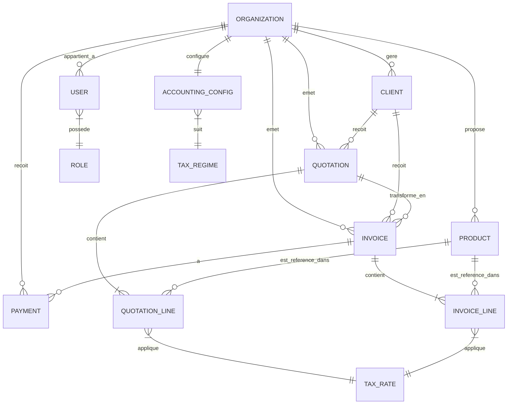

# Modèle de Données - GEKKO-Entreprise (Micro-ERP SaaS)

Ce document détaille la structure de la base de données nécessaire pour supporter les fonctionnalités de gestion, de facturation et de conformité comptable au Maroc.

## Schéma Conceptuel (ERD)

## Description des Entités

### 1. Organisation (Entrepreneur / TPE)

C'est le "Tenant" principal. Chaque entrepreneur a sa propre organisation.

- **id** (UUID): Clé primaire.
- **nom_social**: Nom de l'entreprise.
- **forme_juridique**: (SARL, Auto-entrepreneur, etc.).
- **adresse**: Siège social.
- **ICE**: Identifiant Commun de l'Entreprise (15 chiffres). [OBLIGATOIRE]
- **IF**: Identifiant Fiscal.
- **RC**: Numéro de Registre du Commerce.
- **TP_Patente**: Taxe Professionnelle.
- **CNSS**: Numéro d'affiliation.
- **capital_social**: (Optionnel).

### 2. Utilisateurs & Rôles

- **User**:
  - **id**, **email**, **password_hash**.
  - **role_id**: Lien vers le rôle.
  - **organization_id**: Lien vers l'organisation.
- **Role**:
  - **name**: (Admin, Comptable, Commercial).
  - **permissions**: JSON ou drapeaux (read_invoice, create_invoice, edit_settings, etc.).

### 3. Clients

- **id**, **organization_id**.
- **nom_complet / Raison sociale**.
- **ICE**: (Obligatoire pour les clients B2B au Maroc).
- **IF**, **Adresse**.
- **contact_nom**, **email**, **telephone**.

### 4. Produits & Services

- **id**, **organization_id**.
- **reference**: (Sku).
- **designation**: Nom du produit/service.
- **prix_unitaire_ht**: Prix de base.
- **unite**: (Heure, Jour, Unité, Kg, etc.).
- **default_tax_rate_id**: Taux de TVA par défaut associé.
- **compte_comptable**: Numéro de compte comptable selon le PCM (ex: 7111 pour vente de marchandises, 7121 pour vente de prestations de services). [NOUVEAU]

### 5. Devis (Quotations)

- **id**, **organization_id**, **client_id**.
- **numero**: (Ex: DE-2024-001).
- **date_emission**, **date_expiration**.
- **statut**: (Brouillon, Envoyé, Accepté, Refusé, Facturé).
- **total_ht**, **total_tva**, **total_ttc**.

### 6. Lignes de Devis (Quotation Lines)

- **id**, **quotation_id**, **product_id**.
- **description**, **quantite**, **prix_unitaire_ht**.
- **discount_amount**: Montant de la remise appliquée à cette ligne. [NOUVEAU]
- **taux_tva_id**, **montant_tva**, **montant_ttc**.

### 7. Factures (Invoices)

- **id**, **organization_id**, **client_id**.
- **quotation_id**: (Optionnel) Lien vers le devis d'origine si converti. [NOUVEAU]
- **type**: (Facture, Avoir). Détermine s'il s'agit d'une facture standard ou d'un avoir (credit note). [NOUVEAU]
- **numero**: (Ex: FA-2024-001 ou AV-2024-001). Chronologie stricte à respecter.
- **date_emission**, **date_echeance**.
- **statut**: (Brouillon, Validée, Payée, Impayée). Le statut 'Annulée' est supprimé ; les corrections s'effectuent par Avoir. [MODIFIÉ]
- **total_ht**, **total_tva**, **total_ttc**.

### 8. Lignes de Facture (Invoice Lines)

- **id**, **invoice_id**, **product_id**.
- **description**, **quantite**, **prix_unitaire_ht**.
- **discount_amount**: Montant de la remise appliquée à cette ligne. [NOUVEAU]
- **taux_tva_id**, **montant_tva**, **montant_ttc**.

### 8b. Paiements (Payments) [NOUVEAU]

- **id**, **organization_id**, **invoice_id**.
- **montant**: Montant payé (stocké en centimes/décimal).
- **date_paiement**: Date effective du paiement.
- **mode_paiement**: (Virement, Chèque, Espèces, Effet).
- **reference**: Optionnel (ex: numéro de chèque, référence de virement).

### 9. Configuration Comptable & Taxes

- **TaxRate**:
  - **valeur**: (20, 14, 10, 7, 0).
  - **label**: (Standard, Intermédiaire, Réduit, Super-réduit, Exonéré).
- **AccountingConfig**:
  - **regime_tva**: (Débits ou Encaissements).
  - **secteur_activite**: Détermine le taux par défaut.
  - **cloture_exercice**: Date de fin de l'exercice (généralement 31/12).

---

## Intégrité & Calculs

1. **Validation ICE** : Le système doit vérifier que l'ICE comporte exactement 15 chiffres.
2. **Calcul TVA Automatique** :
   - `Ligne_TVA = (Quantité * Prix_Unit_HT - Discount) * (Taux / 100)`
   - `Ligne_TTC = (Quantité * Prix_Unit_HT - Discount) + Ligne_TVA`
3. **Sécurité SaaS** : Chaque requête SQL doit inclure une clause `WHERE organization_id = current_org_id` pour isoler les données.
