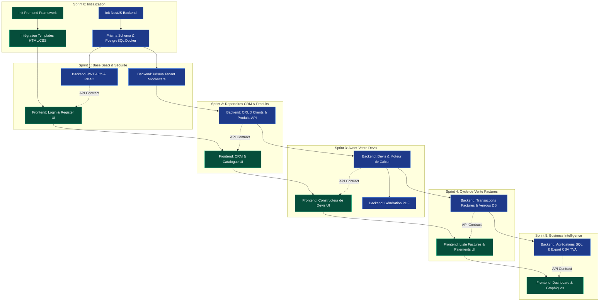

L# GEKKO-Entreprise (Micro-ERP SaaS) - Scrum Backlog & PERT

Ce document organise le travail de développement de GEKKO-Entreprise sous forme de méthode Agile (Scrum). Étant donné que le projet part de zéro (uniquement la documentation et les templates UI statiques existent), le backlog inclut un **Sprint 0** d'initialisation.

> [!TIP]
> Les tâches sont structurées pour maximiser le parallélisme entre le Backend (NestJS) et le Frontend (React/Vue), permettant à deux développeurs (ou un développeur full-stack) d'avancer efficacement.

---

## 📊 Diagramme PERT (Dépendances et Parallélisme)

Ce diagramme illustre le chemin critique du projet. Notez comment le Backend et le Frontend peuvent travailler en parallèle une fois les fondations (Sprint 0 & 1) posées.

---

## 🏃 Sprint 0 : Initialisation & DevOps (Chemin Critique)
**Objectif :** Préparer les environnements de développement Backend et Frontend à partir de zéro.

- [ ] **US 0.1 : Setup Backend** (Backend)
  - Initier NestJS, configurer ESLint/Prettier, et préparer la validation des variables d'environnement (`.env`).
- [ ] **US 0.2 : Setup Database** (Backend)
  - Créer le fichier `docker-compose.yml` (PostgreSQL), initier Prisma, et traduire le `database_model.md` en `schema.prisma`.
- [ ] **US 0.3 : Setup Frontend** (Frontend)
  - Initier le framework Frontend (ex: Next.js) et importer les assets existants (`stitch_gekko_invoicing_saas_ui`). Configurer le routeur de base.

## 🏃 Sprint 1 : Base SaaS, Sécurité & Multi-tenant
**Objectif :** Architecture fondamentale du SaaS, isolation hermétique (Tenant) et sécurité d'accès.

- [ ] **US 1.1 : Inscription d'une Organisation** (Full-Stack)
  - _Backend:_ API création organisation, validation stricte ICE (15 chiffres).
  - _Frontend:_ Formulaire d'inscription.
- [ ] **US 1.2 : Authentification & Isolation** (Backend - **CRITIQUE**)
  - Implémentation du JWT, Guards NestJS, et du Middleware Prisma pour isoler les requêtes par `organization_id`.
- [ ] **US 1.3 : Gestion des Rôles (RBAC)** (Full-Stack)
  - _Backend:_ Décorateurs `@Roles()`. _Frontend:_ UI de gestion des collaborateurs.

## 🏃 Sprint 2 : Répertoires de Base (Clients & Catalogue)
**Objectif :** Permettre la gestion de la BDD Clients et du catalogue Produits (prérequis pour les devis). *(Ici, Frontend et Backend travaillent en parallèle).*

- [ ] **US 2.1 : CRM B2B / B2C** (En Parallèle)
  - _Backend:_ Endpoints GET/POST/PATCH Clients.
  - _Frontend:_ Intégration du template "gestion_des_clients".
- [ ] **US 2.2 : Catalogue Produits & Taxes** (En Parallèle)
  - _Backend:_ CRUD Produits et paramétrage des `TaxRate`.
  - _Frontend:_ Intégration UI du catalogue.

## 🏃 Sprint 3 : Processus Avant-Vente (Devis)
**Objectif :** Moteur intelligent de Devis, tables de remises et calcul des taxes.

- [ ] **US 3.1 : Moteur de Calcul (Backend)**
  - Calcul sécurisé côté serveur des lignes (TVA, Remise, HT, TTC) via `InvoicingService`.
- [ ] **US 3.2 : Constructeur de Devis (Frontend)**
  - Intégration de l'UI complexe d'ajout dynamique de lignes de devis.
- [ ] **US 3.3 : Génération PDF** (Backend)
  - Conversion des données de devis en PDF soigné avec logo de l'entreprise.

## 🏃 Sprint 4 : Cycle de Vente & Conformité (Factures)
**Objectif :** Transformer les devis en pièces comptables légales avec verrouillage.

- [ ] **US 4.1 : Transformation & Transactions** (Backend - **CRITIQUE**)
  - Utilisation de `prisma.$transaction` pour convertir un Devis en Facture de manière atomique (sans perte de données).
- [ ] **US 4.2 : Sécurité de la Chronologie Légale** (Backend - **CRITIQUE**)
  - Utilisation de "Row-Level Locking" pour assurer que les identifiants (FA-2024-001) se suivent strictement sans trou.
- [ ] **US 4.3 : UI Facturation & Paiements** (Frontend)
  - Intégration du template "liste_des_factures" et "details_de_la_facture".

## 🏃 Sprint 5 : Business Intelligence & Exports Compta
**Objectif :** Chiffres clés et export conforme pour télédéclaration au Maroc.

- [ ] **US 5.1 : Tableau de Bord** (En Parallèle)
  - _Backend:_ Requêtes `prisma.$queryRaw` pour statistiques de CA.
  - _Frontend:_ Intégration du template "dashboard" et graphiques.
- [ ] **US 5.2 : Générateur d'Export de TVA** (Backend)
  - Service de génération de fichier CSV conforme aux normes fiscales marocaines.
